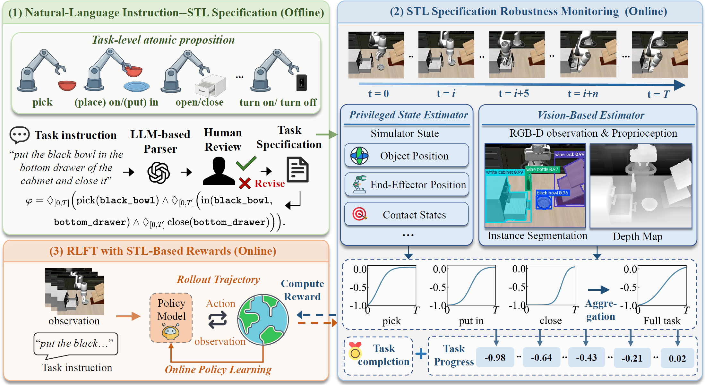

# SpecRL: Specification-Guided Dense Rewards for VLA Reinforcement Learning

<p align="center">
  
</p>

This bundle contains the implementation used by the SpecRL experiments. SpecRL
provides specification-guided dense rewards for reinforcement learning
fine-tuning of vision-language-action (VLA) models.

## Abstract

Reinforcement learning fine-tuning (RLFT) has emerged as a promising approach
for adapting pretrained vision-language-action (VLA) models through
task-directed interaction. However, many existing methods rely on sparse binary
rewards, which provide limited guidance for policy optimization and thereby
hinder learning performance. While recent approaches seek denser feedback via
LLM-generated reward functions or vision-language model evaluations, they are
often inefficient and the resulting rewards are often unreliable, potentially
introducing errors that misguide policy optimization.

In this work, we propose SpecRL, a specification-guided framework designed to
provide dense, interpretable online rewards for RLFT. The core idea is to
formalize task requirements in Signal Temporal Logic (STL) and derive rewards
from its explicit quantitative semantics. Specifically, SpecRL leverages an
LLM-aided process to convert language instructions into STL specifications
constituted by task-level atomic propositions. During execution, SpecRL
evaluates proposition satisfaction using either a privileged-state grounding or
a lightweight visual grounding module, supporting both simulation and
real-world deployments. A runtime monitor then aggregates the quantitative
values of propositions along the specification's temporal structure,
translating fine-grained task progress into dense rewards for online policy
fine-tuning. Extensive evaluations on the LIBERO benchmark show that
privileged-state SpecRL improves the success rate over binary-reward RLFT by
$3.3$ percentage points, while visual SpecRL surpasses the strongest visual
baseline by $4.8$ percentage points with $1.43\times$ faster training. Real-world
trajectory evaluations further demonstrate that its deterministic and
interpretable design delivers more accurate reward feedback than baselines.

## Framework Architecture

The pipeline has two stages:

1. **Offline instruction parsing:** an LLM converts natural-language
  instructions into structured JSON task representations containing STL-style
  atomic propositions.
2. **Online grounding and monitoring:** the propositions are evaluated against
  privileged simulator state or visual observations, then aggregated into
  continuous dense rewards for policy optimization.

## Requirements

- Python 3.11.14.
- PyTorch 2.6.
- Ubuntu 22.04.4 LTS for the provided training launchers.
- NVIDIA CUDA runtime with eight GPUs; NVIDIA A100 80 GB GPUs are recommended
  for VLA training.

## Real-World Deployment

SpecRL also supports physical robot deployments. The reference real-world
setup uses a Franka Research 3 manipulator, an Intel RealSense D455 global
camera, and a wrist-mounted ZED Mini camera.

## Code Bundle

This directory preserves the original repository-relative layout for the code
used by these two launch commands:

```bash
bash scripts/run_ppo_8gpu_SpecRL_P.sh
bash scripts/run_ppo_8gpu_SpecRL_V.sh goal
```

`SpecRL_P` evaluates proposition satisfaction using privileged-state grounding;
`SpecRL_V` evaluates it using lightweight visual grounding.

## Included

- `scripts/`: the two top-level launchers and the YOLOE service launch/server.
- `examples/embodiment/`: shared training entry points, AGM runtime hooks, and
  the Hydra configurations selected by the two launchers.
- `rlinf/`: the RLinf runtime source required by the two SpecRL launch paths.
  Under `rlinf/envs`, only LIBERO and its shared vector/wrapper utilities are
  retained; unrelated environment implementations are intentionally omitted.
- `requirements/`, `pyproject.toml`, and `uv.lock`: dependency and installation
  metadata.
- `llm_symbolic_parity_results_revised.json`: the role-level stage-plan table
  loaded and grounded at runtime.
- `llm_symbolic_parity.py`: offline/online structural-parity evaluation
  for the 40 LIBERO instructions. Online mode uses `--online`.

Generated caches, backup files, logs, checkpoints, virtual environments, and
model weights are intentionally excluded.

## External runtime assets

Running this bundle requires supplying the following external assets and
environment variables:

- the `.venv_embodied_openpi` training environment;
- the `.yoloe_venv` YOLOE environment for visual training;
- the OpenPI SFT checkpoint (`SFT_checkpoint` in the original scripts);
- `OPENPI_DATA_HOME`;
- the YOLOE weights;
- an eight-GPU Linux/CUDA runtime and the LIBERO dependencies/assets.

For the standalone reward validation utilities, set `LIBERO_PATH` and
`OPENVLA_REPO`; model-based validation additionally requires
`OPENVLA_MODEL_PATH`. The training launchers require `OPENPI_DATA_HOME` to be
set to the local OpenPI data directory.

